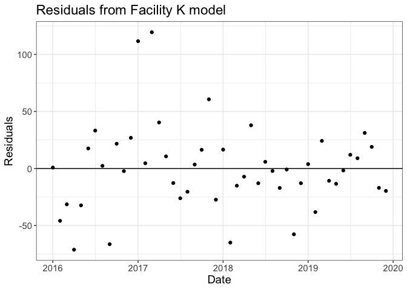

-   [About:](#about)
-   [Goals:](#goals)
-   [Modeling technique:](#modeling-technique)
    -   [Facility-level models:](#facility-level-models)
    -   [Aggregated models:](#aggregated-models)
    -   [Deviations and data
        visualizations:](#deviations-and-data-visualizations)
    -   [Missing data considerations:](#missing-data-considerations)
-   [Overview of folders and files:](#overview-of-folders-and-files)
    -   [Data](#data)
    -   [R](#r)
-   [Examples](#examples)
    -   [Loading Data and Functions](#loading-data-and-functions)
    -   [Example 1: Single Facility](#example-1-single-facility)
    -   [Example 2: Fit multiple facilities at
        once](#example-2-fit-multiple-facilities-at-once)
    -   [Example 3: Aggregated results](#example-3-aggregated-results)
    -   [Example 4: Model diagnostics](#example-4-model-diagnostics)

About:
------

This repository contains code to follow the Data Processing Pipeline for
the Global Covid-19 Syndromic Surveillance Team - a partnership between
sites at Partners in Health, the Global Health Research Core at Harvard
Medical School, and Brigham and Women’s Hospital. The data has been
modified to respect the privacy of our sites, in hopes that other groups
can benefit from the functions we have written.

This repository contains data, code, and other items needed to reproduce
this work. Further explanation of outputs and their construction is
given in the “Overview of folders and files” section, which includes
detailed explanations of the functions we have written.

Goals:
------

The main goal of the Global COVID-19 Syndromic Survillance Team is to
monitor changes in indicators that may signal changes in COVID-19 case
numbers in health systems from our seven partnering countries: Haiti,
Lesotho, Liberia, Malawi, Mexico, and Rwanda. This is accomplished
through establishing a baseline using prior data, and monitoring for
deviations for relevant indicators. The data visualization tools created
using our functions allow identification of local areas that are
experiencing upticks in COVID-19-related symptoms.

Modeling technique:
-------------------

The process starting with the raw data and finishing with the various
outputs is referred to as the Data Processing Pipeline (see Figure 1
below):

After data has been cleaned, it is processed according to the level it
is available at (either on a facility of county/district basis) for each
indicator. This is done by taking data from a historic baseline period,
and then projecting it into the evaluation period. This then is compared
to the observed counts/proportions. For our purposes, we have defined
the baseline period to be data from January 2016-December 2019.

The functions included in this repository focus on the modeling and
processing stages.

### Facility-level models:

For facility-level assessments, we fit a generalized linear model with
negative binomial distribution and log-link to estimate expected monthly
counts. This model is an adaptation of that proposed by Dan Weinberger
lab
(<a href="https://weinbergerlab.github.io/ExcessILI/articles/PImortality.html" class="uri">https://weinbergerlab.github.io/ExcessILI/articles/PImortality.html</a>).
If data is available on a more granular level, then weekly or daily
terms could be added to the equation to capture other types of trend. To
calculate the prediction intervals, we used ciTools R package
(<a href="https://cran.r-project.org/web/packages/ciTools/ciTools.pdf" class="uri">https://cran.r-project.org/web/packages/ciTools/ciTools.pdf</a>).

For proportions, in which the numerator is indicator counts and the
denominator is outpatient visits, we produced similar prediction
intervals using the following procedure: we performed a parametric
bootstrap procedure that generates random monthly indicator counts from
the prediction intervals described above and kept the total outpatient
visits fixed. This gives empirical estimates and prediction intervals
for proportions. If there were missing values for the monthly outpatient
visit count, instead of deleting those months and doing a complete-case
analysis which would waste existing indicator count data, we performed
an imputation procedure as follows: first, we fit the aforementioned
model for outpatient visits instead of indicator counts, and using that
model’s estimates, imputed the missing denominator values. Then, we can
do the parametric bootstrap procedure with the additional step of
randomly imputing missing denominator values in order to account for
variation and uncertainty in these imputed outpatient values.

### Aggregated models:

It was also of interest to perform syndromic surveillance at aggregated
levels (e.g. district or county). If there was no missing monthly data,
one could simply sum the indicator counts across all facilities within a
district (or county) and fit the above model. However, data often
contains months with missing counts at the facility-level. We used a
parametric bootstrap to impute the missing values from the
facility-level models in the previous section. We drew realizations of
the ARI counts for each month and each facility and then summed these
values for an aggregated estimate. We repeated this procedure 500 times
and took the 2.5th and 97.5th percentiles to create 95% prediction
intervals. For region-level proportions, the number of outpatient visits
can be summed across facilities and a proportion can be computed. If
there are missing values in the outpatient visits, another step can be
included in the above parametric bootstrap procedure where missing
outpatient visits are generated from fitting the above model and where Y
indicates monthly outpatient visit count.

### Deviations and data visualizations:

We defined a deviation as the difference between the predicted and
observed count. To allow interpretation across facilities and regions of
different sizes, we divided by the predicted count for a scaled
deviation measure ((expected-observed)/expected), where positive values
mean that the observed number of acute respiratory infections is higher
than expected, potentially indicating circulation of COVID-19. In our
data visualizations, we report this scaled deviation measure in addition
to indicating if the observed count falls outside of the 95% prediction
interval. We provide 2 ways here to visualize the results: time series
plots and tiled heatmaps, with examples shown below.

### Missing data considerations:

We excluded facilities from our analysis for two reasons: (1) missing
dates in the baseline period (creation of the expected counts model) (2)
missing observed counts in the evaluation period.

For the first reason, facilities with high levels of missing data (more
than 20% of baseline dates missing) were excluded. Although there are
statistical methods that can handle missing time series data, we decided
to only include sites that demonstrated ability to collect data over
time. A complete case (time) analysis was conducted with included
facilities, which assumes that the counts were missing completely at
random (MCAR). Specifically, we assumed the reason for missing counts
was independent of time and count value. If the MCAR assumption was
violated and we had information about the missing data mechanism, one
could impute values for the missing data and report unbiased expected
counts and correct inference.

For the second reason, facilities with ANY missing monthly data during
the evaluation period (January 2020 onward) were removed. As the
syndromic surveillance exercise hinges on comparing the observed counts
to the expected and flagging for deviations, we require complete
observed data during this period. In this context, it would be invalid
to impute observed counts based on information from the baseline period.
In theory, one could attempt to impute the observed count based on
information during the evaluation period.

Overview of folders and files:
------------------------------

### Data

This folder contains an example dataset used to demonstrate
functions.The facility-level dataset used to demonstrate the functions
throughout this repository. Note: facility names and values have been
altered to respect the privacy of our sites.

### R

This folder contains the functions used to fit the time series models,
create the key data visualizations, and conduct model diagnostics.

Examples
--------

#### Loading Data and Functions

    source("R/model_functions.R")
    source("R/model_figures.R")
    source("R/model_diagnostics.R")

    data <- readRDS("data/data_example.rds")

    head(data)

    ## # A tibble: 6 x 5
    ##   date       facility   county       ari_cases total_visits
    ##   <date>     <chr>      <chr>            <dbl>        <dbl>
    ## 1 2016-01-01 Facility K County Alpha       220         3140
    ## 2 2016-01-01 Facility Q County Alpha        22          182
    ## 3 2016-02-01 Facility K County Alpha       177         3515
    ## 4 2016-02-01 Facility Q County Alpha        21          247
    ## 5 2016-03-01 Facility K County Alpha       171         3761
    ## 6 2016-03-01 Facility Q County Alpha        20          282

The example data contains two health facilities: “Facility K” and
“Facility Q”. The indicator of interest is acute respiratory infections
(first column: ari\_cases) with total outpatient visits
(total\_visits)–a measure of healthcare utilization.

#### Example 1: Single Facility

We take an example facility–“Facility K”, run the facility-specific
model for one specific indicator–“ari\_cases”, with the associated
denominator–“total\_visits” and other parameter specifications as seen
below, and look at the results through the counts and proportion lenses.

    # Declare this for all functions
    extrapolation_date <- "2020-01-01"

    # Run Facility-level Model
    fit.site.specific.denom.pi(data=data,
                               site_var="facility",
                               site_name="Facility K",
                               extrapolation_date=extrapolation_date,
                               indicator_var="ari_cases",
                               denom_var="total_visits", 
                               date_var="date",
                               R=500) -> single.facility.results

    ## [1] "Overdispersion detected for Facility K. Negative binomial will be used."

The dataframe *single.facility.results* contains the following fields:
observed counts, estimated counts, prediction intervals for counts,
observed proportion, estimated proportion, and prediction intervals for
proportions.

    head(single.facility.results)

    ##         site       date observed est_count ci_count_low ci_count_up
    ## 1 Facility K 2016-01-01      220  219.2009      123.475     346.525
    ## 2 Facility K 2016-02-01      177  222.8679      142.475     333.050
    ## 3 Facility K 2016-03-01      171  202.4128      116.000     319.525
    ## 4 Facility K 2016-04-01      124  195.2028      115.950     289.000
    ## 5 Facility K 2016-05-01      182  214.2785      130.425     333.000
    ## 6 Facility K 2016-06-01      236  218.4203      125.950     331.050
    ##   observed_prop   est_prop ci_prop_low ci_prop_up
    ## 1    0.07006369 0.06863057  0.04089968 0.11273885
    ## 2    0.05035562 0.07083926  0.04237553 0.11749644
    ## 3    0.04546663 0.06740229  0.03894576 0.10330364
    ## 4    0.03607797 0.06400931  0.03520512 0.09965813
    ## 5    0.05824000 0.06752000  0.03934400 0.10337600
    ## 6    0.06608793 0.07084850  0.04115094 0.10823999

We can view plots of the results for Facility K, for counts and for
proportions, by running the following function and passing in the
facility-specific model results dataframe as the first parameter and
either “count” or “proportion” as the second parameter.

##### Single Facility Counts Results

    plot_site(single.facility.results,type="count", title="Acute Respiratory Infections at Facility K")

The observed count is given by the **black line** (raw data from DHIS2).
The expected (predicted) count is given by the **red
line** with 95% prediction intervals in light red (using the
model described above).

##### Single Facility Proportions Results

    plot_site(single.facility.results,type="proportion", title="Acute Respiratory Infections at Facility K")

#### Example 2: Fit multiple facilities at once

If there are multiple facilities, we may wish to fit multiple models at
one time. Here, we provide code to apply over the function. Note that
the same logic can be applied for multiple indicators across multiple
sites.

    # get all facilities
    all_sites <- data %>% distinct(facility) %>% pull()

    # loop over all  facilities
    do.call(rbind, lapply(all_sites,function(x){
          fit.site.specific.denom.pi(data=data,
                                  site_name=x,
                                  extrapolation_date=extrapolation_date,
                                  indicator_var="ari_cases",
                                  denom_var="total_visits",   # corresponding denominator indicator needed for proportions
                                  site_var="facility",
                                  date_var="date",
                                  R=500)
      })
    ) -> facility.results

    ## [1] "Overdispersion detected for Facility K. Negative binomial will be used."
    ## [1] "Overdispersion detected for Facility Q. Negative binomial will be used."

The dataframe *facility.results* combines the results for each facility
with the *site* variable linking to the correct facility.

    head(facility.results)

    ##         site       date observed est_count ci_count_low ci_count_up
    ## 1 Facility K 2016-01-01      220  219.2009      128.475     352.050
    ## 2 Facility K 2016-02-01      177  222.8679      134.950     328.525
    ## 3 Facility K 2016-03-01      171  202.4128      125.475     320.625
    ## 4 Facility K 2016-04-01      124  195.2028      119.000     296.525
    ## 5 Facility K 2016-05-01      182  214.2785      128.475     340.000
    ## 6 Facility K 2016-06-01      236  218.4203      132.950     336.625
    ##   observed_prop   est_prop ci_prop_low ci_prop_up
    ## 1    0.07006369 0.06863057  0.04089968 0.11273885
    ## 2    0.05035562 0.07083926  0.04237553 0.11749644
    ## 3    0.04546663 0.06740229  0.03894576 0.10330364
    ## 4    0.03607797 0.06400931  0.03520512 0.09965813
    ## 5    0.05824000 0.06752000  0.03934400 0.10337600
    ## 6    0.06608793 0.07084850  0.04115094 0.10823999

We can view plots of the results for both facilities together by running
the following function and passing in the *facility.results* dataframe
as the first parameter and either “count” or “proportion” as the second
parameter.

    plot_facet(facility.results,type="count")

Also useful are heatmaps, especially for comparison between the
different facilities using the deviation metric as described above.
Again, the first parameter in the function below is the model output,
and the second parameter is either “count” or “proportion”:

    plot_heatmap(facility.results,type="count")

**Note:** the black border boxes indicate the count (or proportion)
falls outside the prediction interval.

#### Example 3: Aggregated results

We now wish to calculate a total count for the both facilities. Note
that we decide not to sum the ARI cases and total visit counts in the
two facilities because there are several values missing, which would
result in an underestimated count during these months if ignored
(i.e. assumed to be zero).

    data %>% filter(is.na(ari_cases) | is.na(total_visits))

    ## # A tibble: 3 x 5
    ##   date       facility   county       ari_cases total_visits
    ##   <date>     <chr>      <chr>            <dbl>        <dbl>
    ## 1 2018-08-01 Facility K County Alpha       106           NA
    ## 2 2019-07-01 Facility Q County Alpha        NA           NA
    ## 3 2019-10-01 Facility K County Alpha       125           NA

    fit.aggregate.pi.boot(data,
                          indicator_var = "ari_cases",
                          denom_var = "total_visits",
                          date_var = "date",
                          site_var = "facility",
                          R=500) -> aggregate.results

The results are given by the data frame *aggregate.results* with the
same columns ast the facility-level model.

    head(aggregate.results)

    ##         date observed est_count ci_count_low ci_count_up observed_prop
    ## 1 2016-01-01      242     244.0      162.425     364.000    0.07284768
    ## 2 2016-02-01      198     244.0      159.425     359.050    0.05263158
    ## 3 2016-03-01      191     221.0      141.475     334.100    0.04724215
    ## 4 2016-04-01      147     219.5      137.000     321.050    0.04003268
    ## 5 2016-05-01      213     240.0      156.475     363.575    0.06235363
    ## 6 2016-06-01      270     256.0      159.000     377.050    0.06894791
    ##     est_prop ci_prop_low ci_prop_up
    ## 1 0.07314871  0.04799067 0.10944461
    ## 2 0.07123870  0.04545455 0.10863238
    ## 3 0.06690576  0.04340218 0.10217660
    ## 4 0.06467865  0.04097903 0.09806645
    ## 5 0.07128220  0.04344994 0.10424473
    ## 6 0.07533197  0.05017237 0.11174030

We can view similar plots as for the facility-specific plots above but
now for the county of interest, using the same plotting function:

    plot_site(aggregate.results, "count", title="Facility K and Q Aggregated Results")

#### Example 4: Model diagnostics

We recommend reading
(<a href="https://otexts.com/fpp2/residuals.html" class="uri">https://otexts.com/fpp2/residuals.html</a>)
for a detailed overview on the evaluation of time series regression
models. We provide code to replicate the plots and statistical tests
from this resource using the output from our main functions. We first
show the residual pltos for the aggregate results (Facility K and
Facility Q) and then for the facility-level results for County K.

    plot_residuals(aggregate.results,
                   type="count",
                   extrapolation_date="2020-01-01",
                   title="Residuals from Aggregated model")

    plot_residuals(single.facility.results,
                   type="count",
                   extrapolation_date="2020-01-01",
                   title="Residuals from Facility K model")

We then look at the Partial Autocorrelation Function and Autocorrelation
Function plots for Facility K. The same code can be used for the
aggregated results.

    plot_pacf(single.facility.results,
              type="count",
              extrapolation_date="2020-01-01",
              title="PACF for Facility K")

    plot_acf(single.facility.results,
             type="count",
             extrapolation_date="2020-01-01",
             title="ACF for Facility K")

Lastly, we can conduct the Bresuch-Godfrey Test for the facility-level
models (order = 12 for monthly data). This code will apply over multiple
site (or faiclity) results. This provides a way to rapidly identify
problematic model fits for further investigation.

    bgtest_multiple_pval(data=data,
                         indicator_var = "ari_cases",
                         denom_var = "total_visits",
                         date_var = "date",
                         site_var = "facility",
                         extrapolation_date = "2020-01-01",
                         type = "count") 

    ##                          [,1]
    ## Facility K.p.value 0.25580406
    ## Facility Q.p.value 0.04000929

A p-value less than 0.05 indicates evidence of residual correlation. As
such, we should further investigate the model fit for County Q. There is
no evidence of residual correlation in Facility K.
